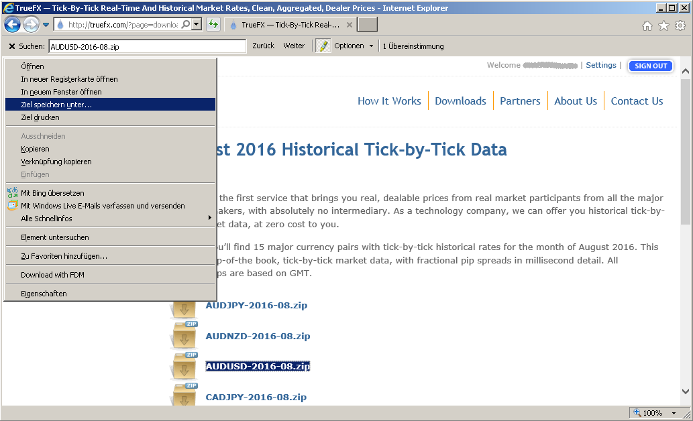

# TrueFX-by-AutoIt3
Download forex tick history from TrueFX.com using AutoIt3 script

## What
This is an [AutIt3](https://www.autoitscript.com) script for downloading forex tick history zip files from TrueFX.com, provided by [Integral](http://www.integral.com/). Keep in mind that their tick data doesn't have to be identical to e.g. from dukascopy. 

## Why
*wget* and *curl* and *aria2* and *FreeDownloadManager* [failed](https://github.com/zaidka/cliget/issues/40) in my case. May be this is an intended new behaviour of TrueFX.com. If they don't want automated downloads, they may also introduce captchas or something similar one day, rendering this script useless, too.

## How
This script opens IE and sends keystrokes and mouse clicks in order to naviagte to and download zip files. Here's what it does - many times, looping through years, months and currency pairs:  

## Prerequisites
###Software
- Windows with InternetExplorer (tested on German 32-bit Windows 7 Professional SP1 with IE v11.0.9600.18449)
- [AutIt3](https://www.autoitscript.com) including SciTE editor (tested with v3.3.14.2 and v3.6.6 respectively)
###Space
Tick data occupies quite some disk space, check if you have a sufficient amount free
###TrueFX.com account
Sing up and sign in (using IE) to TrueFX.com. Set "remember me" option.

## Running
- Open **tfxdnl.au3** in SciTE editor.
- Change years, months, etc according to your needs.
- For the first try, you might want to set $bDontDownload = True.
- Hit F7 to Build and then F5 to run. Watch console messages and IE.

## Limitations
This script downloads files one by one. There is no abnormal situation handling, not even free space check.
